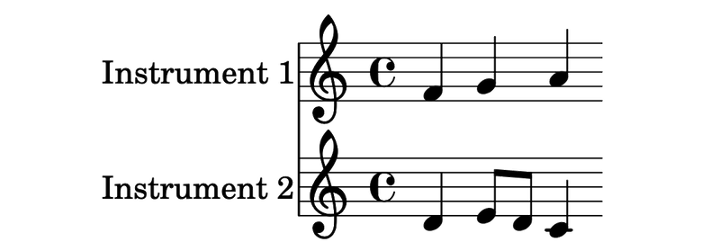
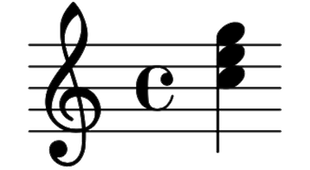
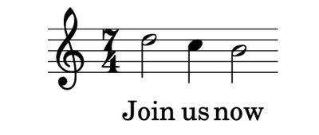
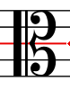
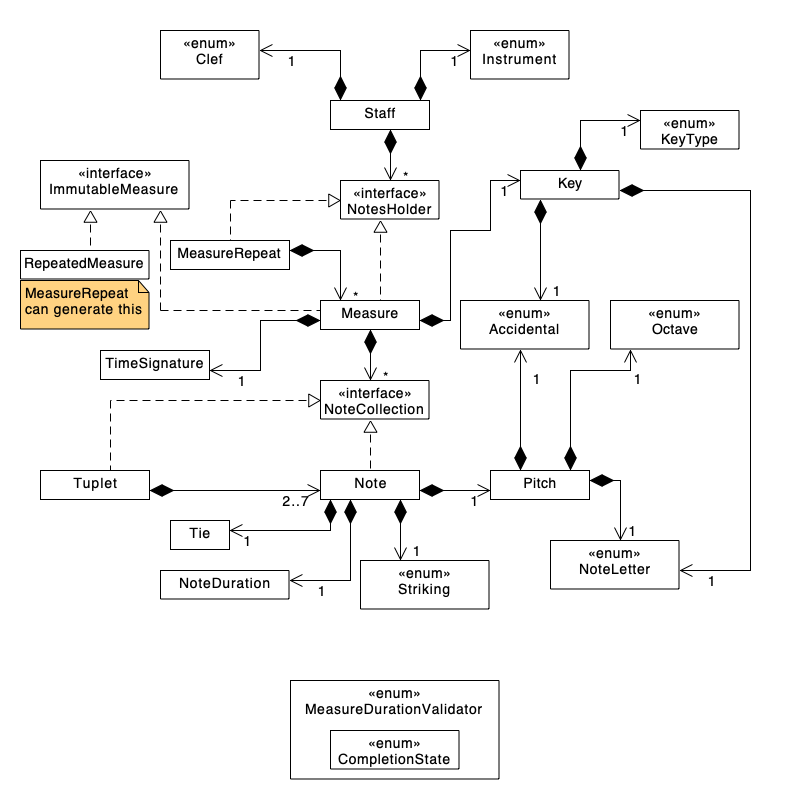

[](https://github.com/music-notation-swift/music-notation)

[](https://github.com/apple/swift-package-manager)
[](https://github.com/music-notation-swift/music-notation/actions/workflows/build-test.yml)
[](https://github.com/music-notation-swift/music-notation/actions/workflows/swiftlint.yml)


# music-notation

Music Notation API written in Swift. It is written so that it can be used in most any operating system, such as iOS, macOS, tvOS. Windows & Linux is aspirational at this point, but since the plan is to eschew all dependencies it should not be much of a stretch. This library is being created with the goal of having near 0 dependencies.

`music-notation` is meant to implement the model and controller layers, which understands how music notation works. It will have no render capabilities, nor input/output. Those functionalities will be implemented in add-on packages.

See `music-notation-render` and `music-notation-io` as well as `music-notation-import`.

The goal is to provide these as [Swift Package Manager](https://github.com/apple/swift-package-manager) based packages. Cocoapods and Carthage will no longer be supported. Manually adding the package into Xcode projects will still be supported.

Please consult this [Swift style guide](https://github.com/music-notation-swift/swift-style-guide) for coding style guidelines used in this repo and be sure to adhere to them.

## Contents

- [1. Features](#1-features)
- [2. Requirements](#2-requirements)
- [3. Installation](#3-installation)
	- [3.1 Swift Package Manager](#31-swift-package-manager)
	- [3.2 Manual Installation](#32-manual-installation)
- [4. Getting Started](#4-getting-started)
- [5. Configuration](#5-configuration)
- [6. Examples](#6-examples)
- [7. Definitions](#7-definitions)
	- [7.1 Score](#71-score)
	- [7.2 Parts](#72-parts)
	- [7.3 Staves](#73-staves)
	- [7.4 Notes](#74-notes)
		- [7.4.1 Duration](#741-duration)
		- [7.4.2 Pitch](#742-pitch)
		- [7.4.3 Rests](#743-rests)
	- [7.5 Measures](#75-measures)
	- [7.6 Multiple Notes and Time](#76-multiple-notes-and-time)
		- [7.6.1 More than one staff](#761-more-than-one-staff)
		- [7.6.2 Multiple voices within a staff](#762-multiple-voices-within-a-staff)
	- [7.7 Lyrics](#77-lyrics)
	- [7.8 Clefs](#78-clefs)
	- [7.9 Time Signatures](#79-time-signatures)
		- [7.9.1 Meter and time signatures](#791-meter-and-time-signatures)
		- [7.9.2 Notating meter](#792-notating-meter)
	- [7.10 Cue Notes](#710-cue-notes)
- [8. FAQ](#8-faq)
- [9. Development Notes](#9-development-notes)
	- [9.1 Code formatting and Linting](#91-code-formatting-and-linting)
		- [9.1.1 Github actions](#911-github-actions)
	- [9.2 Time & Note Chronology](#92-time-note-chronology)
	- [9.3 Different Notes at Same Time](#93-different-notes-at-same-time)
	- [9.4 Indexing Methodology](#94-indexing-methodology)
		- [9.4.1 Audience](#941-audience)
		- [9.4.2 Introduction](#942-introduction)
		- [9.4.3 Example](#943-example)
		- [9.4.4 Implementation](#944-implementation)
			- [9.4.4.1 Overview](#9441-overview)
			- [9.4.4.2 Concrete Example](#9442-concrete-example)
			- [9.4.4.3 Detail](#9443-detail)
			- [9.4.4.4 Efficiency](#9444-efficiency)
			- [9.4.4.5 Usages](#9444-usages)
	- [9.5 Tuplet Design](#95-tuplet-design)
		- [9.5.1 Groupings](#951-groupings)
		- [9.5.2 Definition](#952-definition)
		- [9.5.3 Standard Ratios](#953-standard-ratios)
		- [9.5.4 Compound Tuplets](#954-compound-tuplets)
		- [9.5.5 Validation](#955-validation)
		- [9.5.6 API Design](#956-api-design)
			- [9.5.6.1 API Definition](#9561-api-definition)
			- [9.5.6.2 Secondary duration](#9562-secondary-duration)
			- [9.5.6.3 Usage](#9563-usage)
		- [9.5.7 Implementation Details](#957-implementation-details)
			- [9.5.7.1 Indexing for replaceNote](#9571-indexing-for-replacenote)
		- [9.5.8 Other API Changes](#958-other-api-changes)
			- [9.5.8.1 NoteCollection](#9581-notecollection)
			- [9.5.8.2 NoteDuration](#9582-noteduration)
- [10. Contributing](#10-contributing)
- [11. License](#11-license)
- [12. Attributions](#12-attributions)

## 1. Features

- [x] Modern Swift API
- [x] High Performance Music Notation modeling
- [x] No 3rd party dependencies
- [x] Comprehensive Unit and Performance Test Coverage
- [x] Complete Documentation
- [x] Modular Design for Package Based Extension

## 2. Requirements

- macOS 15+ / iOS 18+ / tvOS 18+ / watchOS 11+
- Swift 5.3+

> Note please see [Package.swift](Package.swift) for the latest Requirements

## 3. Installation

`music-notation` can be installed using [Swift Package Manager](https://swift.org/package-manager/), or manually.

### 3.1 Swift Package Manager

[Swift Package Manager](https://github.com/apple/swift-package-manager) requires Swift version 6.0 or higher. First, create a `Package.swift` file. It should look like:

```swift
dependencies: [
    .package(url: "https://github.com/music-notation-swift/music-notation.git", from: "0.2.9")
]
```

`swift build` should then pull in and compile `music-notation` for you to begin using.

#### 3.1.1 Xcode SPM Support

You can also install SPM packages directly within your Xcode project.

### 3.2 Manual Installation

To install manually, you'll need to clone the `music-notation` repository. You can do this in a separate directory or you can
make use of git submodules. Once this is done, you can just drop the files that are in the `Sources/music-notation` folder
into your project. If you use a folder reference instead of a group, every time you pull from the source repository you will get
any newly added files without having to determine if new files were added and then manually adding them.

> NOTE: if you're targeting iOS 7, you'll have to install manually because
> embedded frameworks require a minimum deployment target of iOS 8 or OSX
> Mavericks.

## 4. Getting Started

**WIP** [music-notation-import](https://github.com/music-notation-swift/music-notation-import) is currently the first real client and usage example for the package.
It isn't on github yet, but as soon as it starts working, I will be selecting snippets to show here.

## 5. Configuration

**WIP** Since much of the concrete implementation will be in packages, this will be the main avenue for configuration.

## 6. Examples

**WIP**

## 7. Definitions

For the purpose of describing music and the parts that are modelled by this library, some definitions will be required.
This will inform the name of the classes and structs that model these components.

### 7.1 Score

A score is description in music notation of a piece of music which contains one or more parts. It also contains descriptions which pertain to the score overall.

Examples include:
- Name of the score
- Name of the Artist
- Subtitle of the piece of music that the score describes.

Here is an example of (part of) a score (Beethoven - Symphony No. 9 Op. 125, downloaded from Musescore.com).


In the example you can see elements of the score as well as the staves that make up each of the individual parts.

### 7.2 Parts

A part models a single instrument in the score and as such describes the attributes of the Instrument, as well as part specific data, including one or more staves.

Examples include:
- Transposition data
- Which staves are present

Here are some examples of a part. In this case they are all a Piano part of a score made for illustration purposes.

- A part with a single staff (**note**: this shows the title, subtitle, and more)
	
- A part with a grand staff (treble and bass clef staves)
	
- A part with a single staff, as well as a slash notation staff and a Tablature staff
	

### 7.3 Staves

Music notation at its essense is represented by one or more staves. One staff consists of five horizontal lines, called _staff lines_:


### 7.4 Notes

Each staff usually contains a single _melody_, which often is played by a single instrument. A melody consists of a sequence of _tones_, which are to be played. Each tone is a sound, which a _pitch_ and a _duration_, and the musician that plats the melody, is supposed to emit the sounds corresponding to these tones.

#### 7.4.1 Duration

A note consist of a note head, an optional stem connected to the note head, and an optional flag or beam connected to the stem. The attributes of these decide the duration of a tone:

The duration of one whole note equals the duration of sixteen 16th notes, and so on. The speed, or tempo, of the music, is constant throughout a score. This means that each whole note in a score takes equally long time to play; this is usually between 1 and 4 seconds.

#### 7.4.2 Pitch

The vertical position of a note head defines the tone’s frequency, or pitch. Each pitch is named with an alphabetic letter between a and g, followed by a number of ′ symbols; each ′ symbol denotes that the frequency is multiplied by two. Each staff line represents a pitch. Usually, the pitch on the middle line is b′; this is indicated by drawing a clef in the left edge of the staff. With other clefs, staff lines represent other pitches.


Notes that are typeset in the upper half of a staff, are often typeset upside down. This is a purely typographical decision, and does not affect the semantics of music.

#### 7.4.3 Rests

Silence can be notated using rests. A rest works like a note, except that the musician is silent for the duration of the rest. Rests are notated with special symbols:


The vertical position of a rest has no significance, and unlike notes, rests can not be typeset upside down.

### 7.5 Measures

Notes are played in sequence, from left to right. Time is split into measures of equal duration, separated by bar lines. The duration of each measure is defined by the time signature, which denotes a fraction of a whole note and the meter at which these are accentuated. Until a new time signature is annotated, all the following measures are of the same time signature.


### 7.6 Multiple Notes and Time

When multiple notes are being played at the same time, it can occur because the notes are played as chords (harmony, as played by instruments that can play multiple notes at the same time, for instance a piano). It can also occur when two instruments are playing notes in different [parts](#72-parts) or even when they are being played from different staves in the same part.

#### 7.6.1 More than one staff

A score normally consists of several connected staves, where each staff contains the music played by one instruments. Notes that are played at the same time, are always written in the same horizontal position:



Not only scores use several connected staves: For example, piano music normally uses two staves, containing the notes for the left and right hand, respectively. This can also be seen in guitar music, which needs two staves to be played accurately. One standard notation staff and one tablature staff.

#### 7.6.2 Multiple voices within a staff

Sometimes multiple independant voices of an instrument appear in one staff; in this case, the stem direction decides which notes that should be played by which instrument. The notes with up and down stems are often called the upper and lower voice, respectively. The term “voice” originates from choral music, where this notation is common. Many software notation editors support 4 voices, and during editing are differentiated using colors for each voice.


As mentioned above, a single instrument can also play a chord, consisting of many simultaneous tones. This is notated by adding many note heads to the same stem:



#### 7.7 Lyrics

Vocal music, such as songs, can be notated using music notation. This is done by writing the song text, or lyrics, below the staff that represents the melody to be sung. Each syllable is written right below the note it belongs to:



#### 7.8 Clefs

Music notation has a variety of clefs to indicate what notes the staff lines represent. They all have a symbol within which a point is designated as the note choice.

For instance, the treble clef is a stylized letter G and the curly-cue of the G represents where the G note is on the staff line. See below where the stylized G points to the G staff line (note: this is a French Violin treble clefn).


The bass clef is similar and represents a stylized letter F and the two dots surround the staff line for F.


The alto clef is not similar but represents a stylized way of pointing to the staff in question.



And here a few of them on a staff for comparison.


#### 7.9 Time Signatures

The time signature (also known as `meter signature`, `metre signature`, or `measure signature`) is a notational convention used in Western musical notation to specify how many beats (pulses) are contained in each measure (bar), and which note value is equivalent to a beat.

In a music score, the time signature appears at the beginning as a time symbol or stacked numerals, such as common time or `3/4` (read common time and three-four time, respectively), immediately following the key signature (or immediately following the clef symbol if the key signature is empty). A mid-score time signature, usually immediately following a barline, indicates a change of meter.

There are various types of time signatures, depending on whether the music follows regular (or symmetrical) beat patterns, including simple (e.g., `3/4` and `4/4`), and compound (e.g., `9/8` and `12/8`); or involves shifting beat patterns, including complex (e.g., `5/4` or `7/8`), odd (e.g., `5/8` & `3/8` or `6/8` & `3/4`), additive (e.g., `3 + 2/8 + 3`), fractional (e.g., ​`2½/4`), and complex meters (e.g., `3/10` or `5/24`).

> A regular (`.simple`, `.compound`) time signature is one which represents 2, 3 or 4 main beats per bar.
> - **Duple** time means 2 main beats per bar
> - **Triple** time means 3 main beats per bar
> - **Quadruple** time means 4 main beats per bar
> `.simple` time signatures have a main beat which divides into **two** 1st level sub-beats.
> `.compound` time signatures have a main beat which divides into **three** 1st level sub-beats.
>
> In both `.simple` and `.compound` time, 2nd level sub-beats always subdivide by two (never by three).

##### 7.9.1 Meter and time signatures

Meter involves the way multiple pulse layers work together to organize music in time. Standard meters in Western music can be classified into _simple meters_ and _compound meters_, as well as _duple_, _triple_, and _quadruple meters_.

Duple, triple, and quadruple classifications result from the relationship between the counting pulse and the pulses that are slower than the counting pulse. In other words, it is a question of grouping: how many beats occur in each bar.

If counting-pulse beats group into twos, we have duple meter; groups of three, triple meter; groups of four, quadruple meter. Conducting patterns are determined based on these classifications.

Simple and compound classifications result from the relationship between the counting pulse and the pulses that are faster than the counting pulse. In other words, it is a question of division: does each beat divide into two equal parts, or three equal parts. Meters that divide the beat into two equal parts are simple meters; meters that divide the beat into three equal parts are compound meters.

Thus, there are six types of standard meter in Western music:
- simple duple (beats group into two, divide into two)
- simple triple (beats group into three, divide into two)
- simple quadruple (beats group into four, divide into two)
- compound duple (beats group into two, divide into three)
- compound triple (beats group into three, divide into three)
- compound quadruple (beats group into four, divide into three)

In a time signature, the top number (and the top number only!) describes the type of meter. Following are the top numbers that always correspond to each type of meter:

- simple duple: 2
- simple triple: 3
- simple quadruple: 4
- compound duple: 6
- compound triple: 9
- compound quadruple: 12

##### 7.9.2 Notating meter

As far as I can tell, there can be little to infer about a meter from simply the time signature (especially it's odd'ness).

For example, `8/8` is an odd meter which is counted as **1**-2-3, **2**-2-3, **3**-2 and 4/4 would be **1** &, **2** &, **3** &, **4** &.

And yet `9/8` is an even meter (**1**-2-3, **2**-2-3, **3**-2-3)

In _simple meters_, the bottom number of the time signature corresponds to the type of note corresponding to a single beat. If a simple meter is notated such that each quarter note corresponds to a beat, the bottom number of the time signature is 4. If a simple meter is notated such that each half note corresponds to a beat, the bottom number of the time signature is 2. If a simple meter is notated such that each eighth note corresponds to a beat, the bottom number of the time signature is 8. And so on.

In _compound meters_, the bottom number of the time signature corresponds to the type of note corresponding to a _single division of the beat_. If a compound meter is notated such that each dotted-quarter note corresponds to a beat, the eighth note is the division of the beat, and thus the bottom number of the time signature is 8.

If a compound meter is notated such that each dotted-half note corresponds to a beat, the quarter note is the division of the beat, and thus the bottom number of the time signature is 4. Note that because the beat is divided into three in a compound meter, the beat is always three times as long as the division note, and _the beat is always dotted_.

#### 7.10 Cue Notes

## 8. FAQ

## 9. Development Notes

`music-notation` and the libraries that flesh out specific components based on it, are based on earlier work that can be found in:
- [MusicNotationCore](https://github.com/drumnkyle/music-notation-core)
- [MusicNotationKit](https://github.com/drumnkyle/music-notation-kit)

`music-notation` and the add-on packages are first and foremost designed as [Swift Package Manager](https://github.com/apple/swift-package-manager) packages and as such will not provide Xcode projects.

A notable exception is [music-notation-import](https://github.com/music-notation-swift/music-notation-import) which is a macOS command line utility to parse various other formats and convert them into `music-notation` data structures. Import is primarily a consumer of the packages, which explains the choice of an Xcode project.



### 9.1 Code formatting and Linting

To avoid any conflicts with code formatting, a complete style guide has been provided, as well as project wide linting settings. Please use the base `music-notation` settings, and copy them into any sub-packages intact.

Each project should copy the Github Actions format of: `build & test`, `code coverage`, as well as `linting` badges so that developers can see at a glance whether the project is in a good state.

#### 9.1.1 Github actions

`music-notation` as well as the sub-packages use Github Actions as a Continuous Integration system. Note the provided `workflows`. Each contributing repository should have at least the following actions:

- build-test.yml
This action checks out the code and build it, as well as runs the tests.
A badge appears on the repository indicating `Pass`/`Fail`.

- `llvm-cov.yml`
This action checks out the code and runs the tests while capturing the code coverage.
A badge appears on the repository indicating a coverage percentage.

- `swiftlint.yml`
This action runs `swiftlint` on the code using the settings in the repository's `.swiftlint.yml` settings. These settings should be the same in every package and constitute the base code settings for all packages and projects in the `music-notation` family.
A badge appears on the repository indicating `Pass`/`Fail`.

### 9.2 Time & Note Chronology

Since the `music-notation` allows for the entering of notes in any old order (within API constraints), and musical interpretation of those notes requires some sort of chronological ordering, which path to take?

Do we sort each note chronologically as they are added, or do we provide API for chronologically correct ordering.

If the latter course is taken, do we provide the ordering with a provided granularity?

For instance, do we provide an API that provides all of the notes in order per `score`, `part`, `measure`, `staff`, `voice`?

For now, an on demand note stream is the path `music-notation` is aiming for. It will provide the best path towards fulfilling the needs to the target audience for rendering and for semantic analysis.

### 9.3 Different Notes at Same Time

Authors: [Kyle Sherman](http://github.com/drumnkyle), [Miguel Osorio](http://github.com/modix)

In music, you can have a note with 2 different pitches played at the same time. You see this with one stem and 2 note heads coming off of it on different staff lines/spaces. This has already been accomplished by making every `Note` have an array of `SpelledPitch`es. However, at the same time, you may also have a note of a different duration be played at the same time. Throughout this document I will refer to this as a second *set* of notes in the measure.

#### 9.3.1 Introduction

##### 9.3.1.1 Terminology

- **Set** of notes is one set of notes that need to equal a full measure (like the bass drum part of
a drumset score).
- **Time slice** is the vertical slice of a measure where a note would be laid out. If 2 notes occur
at the same exact time, they would be rendered in the same *time slice*.

##### 9.3.1.2 Example

This happens quite often in drumset music. With a standard rock beat in 4/4, you have the hi-hat playing eighth notes throughout the whole measure. The snare drum plays eighth notes on beats 2 and 4, which can be represented as 2 pitches on the notes that have the snare drum and hi-hat at once. Then, you have the bass drum on beats 1 and 3 as quarter notes with quarter note rests in between.

#### 9.3.2 All Cases

This second set of notes in the measure can occur:

- at the same time as another note in a different set
- in between two notes in a different set

#### 9.3.3 Requirements

- Each set of notes must constitute a full measure (i.e. 4 beats in 4/4; no more, no less)
- You cannot have the same pitch represented by 2 sets at the same exact time. **Open**: Can you?
    - **Open**: How do we enforce this? Seems like it needs to be some type of measure validation.
- Need to support the ability for a rendering library to be able to draw the measure easily
   - time slice by time slice
- API should be as simple as possible to perform measure mutation functionality

#### 9.3.4 Proposed Solution
##### 9.3.4.1 Two Dimensional Array

We take the array of `[NoteCollection]` that we have now and make it two dimensional:
`[[NoteCollection]]`. Each set of notes will be represented as an element in the outermost array.

> Reasoning
	- We can perform measure duration validation on each element of the outermost array completely separately.
	- Rendering index into each sub-array at the same time so that it can easily know if the notes line up with each other in the time slices.
	- API can change to simply have a set index that can default to 0.

##### 9.3.4.2 Graph

We did not explore too deply into this, because it seemed that this would add much complexity. This would especially make it difficult to index into the measure in order to perform any of the mutation functionality. Therefore, we tabled this.

##### 9.3.4.3 Single-Dimensional of structs Representing multiple sets

We thought we might be able to have a single-dimensional array of some protocol type that represented a vertical time slice. This way you would have an simple, single dimensional array. And you would have multiple notes represented in some sort of protocol that represented a single slice of time.

##### 9.3.4.4 Problems

The main issue is that this would make measure duration validation very difficult. Insertion would also become very difficult as you would have to figure out if you needed a new time slice in between two existing ones or if this lines up with a time slice that is already there.

#### 9.4 Indexing Methodology

**Author**: [Kyle Sherman](http://github.com/drumnkyle)

##### 9.4.1 Audience

This design goes over an implementation detail that is only pertinent to maintainers and developers of this library and not to users of the API.

##### 9.4.2 Introduction

Throughout the implementation of multiple structs in this library, a technique is used to allow for indexing of elements within a container in two different ways at the same time. There is indexing that accesses the structs that store the information and then there is indexing used to access the data as a user would see it (flattened).

##### 9.4.3 Example

`Staff` holds an array of `NotesHolder`s. `NotesHolder` is a protocol that both `Measure` and `MeasureRepeat` implement. Therefore, the staff holds an array where each element is either a `Measure` or a structure that stores the data for one or more `Measure`s that are repeated (`MeasureRepeat`).

For a method like `Staff.insertMeasure(at:beforeRepeat)`, the index given to the `at` parameter would take into account the expanded `MeasureRepeat`, including its repeated measures. Therefore, in order to do this indexing, we need to be able to translate from that index to the index in the array of `NotesHolder`s that the `Staff` stores and into the `MeasureRepeat` if that is what exists at the specified index.

##### 9.4.4 Implementation
###### 9.4.4.1 Overview

We have a method called `recompute<Name>Indexes` that gets called in the `didSet` of the array that we need to compute this secondary set of indexes for. For `Staff` the method is called `recomputeMeasureIndexes`. In this method, we loop through the array and get the index of any nested structures and expand those indexes. The resulting data structure is an array of tuples. The tuple has 2 elements: primary index and secondary index. The secondary index is optional, because it is only used if there is a nested data structure at that index.
    
###### 9.4.4.2 Concrete Example

`Staff.recomputeMeasureIndexes()` will set the `measureIndexes` array. This array will store tuples
of `(notesHolderIndex: Int, repeatMeasureIndex: Int?)`.

###### 9.4.4.3 Detail

`recompute<Name>Indexes` will loop through the array and add a tuple entry to the indexes array. If it encounters a nested structure, it will perform a nested loop and add a tuple entry for every element in that nested structure as well.

###### 9.4.4.4 Efficiency

Therefore, the worst case efficiency of this algorithm is `O(n*m)` where `n` is the number of elements in the main array and `m` is the number of elements in the nested structure. Of course, a piece of music is not going to have all nested structures.

To limit the hit to performance, this method is performed only when the array is modified. The idea is that the array will be modified less times than the non-mutating methods will be called. However, this has not been explored or tested fully. The performance has also not been specifically measured.

**Open**: If anyone can think of a more efficient way, please let us know.

**Open**: This seems like it could be useful to make this generic instead of writing very similar code over and over. However, I cannot presently think of a convenient way to do that, though I haven't thought too hard about it yet. 

###### 9.4.4.5 Usages
- Used in `Staff` for the array of `NotesHolder`s.
- Used in `Measure` for the array of `NoteCollection`s.
- Used in `Tuplet` for the array of `NoteCollection`s.

#### 9.5 Tuplet Design

**Author**: [Kyle Sherman](http://github.com/drumnkyle)

##### 9.5.1 Groupings

Most of then you see a grouping of 3, 5, 6, 7, or 9. However, You may also see a grouping of 2, 4, or 8 if you are a time signature where the top number is an odd number. Also, most places that go over tuplets list the following groupings:

- Duplet (2)
- Triplet (3)
- Quadruplet (4)
- Quintuplet (5)
- Sextuplet (6)
- Septuplet (7)
- Octuplet (8)
- Nontuplet (9)

But they all end with etc. Therefore, I don't think we should validate the number. It seems that it can really be any arbitrary number.

##### 9.5.2 Definition

A complete tuplet definition requires knowing how many of what duration fits into the space of how many of a certain duration. This is how you define the ratio.

You can see a simple dialog box that shows this very clearly [here](https://usermanuals.finalemusic.com/Finale2014Mac/Content/Finale/TPDLG.htm).

Usually the two note durations would be the same, but you can do the calculation with any duration. For instance, you would normally define a standard eighth note triplet in 4/4 as "3 eighth notes in the space of 2 eighth notes". However, you could also define that as "3 eighth notes in the space of 1 quarter note". The ratio here would be 3:2.

##### 9.5.3 Standard Ratios

There are certain ratios that are standard, like a triplet would usually have a ratio of 3:2. However, there are also non-standard ratios where you can use whatever you'd like, such as 8:5. It would be good to have the standard ratios defined so that, for instance, a user can create a triplet and not have to define the full ratio.

There should only be a need to list the standard ratios for 2-9. In this case, we can just list them in `Tuplet` struct. This way, if the second number is not specific in the initializer and the first number is one of these, we can fill in the second number according to th static list of default ratios.

**Open**: Can we have one standard ratio per number? Seems like the standard may be based on the time signature. If not, we can use the following standard ratios.

Right now the assumption is that these are the standard ratios:

```
    2: 3
    3: 2
    4: 3
    5: 4
    6: 4
    7: 4
    8: 6
    9: 8
```

##### 9.5.4 Compound Tuplets

You can have a tuplet that is made up of another tuplet, which is made up of another tuplet, and so on. 

In order to support this behavior, the `Tuplet` will store an array of type `NoteCollection` so that it can have a `Note` or `Tuplet` as a value in the array. Also, the `NoteCollection` will have to have a property or set of properties to communicate the duration and number of that duration for
each `NoteCollection`. 
    
i.e. A 3:2 Eighth note tuplet will have a number of 2 and duration of `.eighth`. A single eighth note, would have a number of 1 and duration of `.eighth`

##### 9.5.5 Validation

A tuplet needs to always be full. This means if it is a 3:2 ratio, it needs to have 3 notes in it. However, the notes can be rests. Because of this, the only mutating function should be to replace a note, not remove or add.

You may also have notes of different durations as part of the tuplet as seen [here](http://www2.siba.fi/muste1/index.php?id=100&la=en) where you have triplets with eighth notes and tied quarter notes.

Because of these rules, some type of validation must be done in the initializer to ensure the given notes equate to a full tuplet. This must be built into the `Tuplet` struct.

##### 9.5.6 API Design
###### 9.5.6.1 API Definition

**Open**: Naming is still up for debate. Having trouble with that. We did a first pass and it seems pretty good.

```swift
struct Tuplet: NoteCollection {
    /// The notes that make up the tuplet
    public private(set) var notes: [NoteCollection]

    /// The number of notes of the specified duration that this tuplet contains
    public let noteCount: Int

    /// The duration of the notes that define this tuplet
    public let noteDuration: NoteDuration

    /// The number of notes that this tuplet fits in the space of
    public let noteTimingCount: Int
    
    init(_ count: Int, _ baseNoteDuration: NoteDuration, inSpaceOf baseCount: Int? = nil, notes: [NoteCollection]) throws
    
    mutating func replaceNote<T: NoteCollection>(at index: Int, with noteCollection: T) throws
    mutating func replaceNote<T: NoteCollection>(at index: Int, with noteCollections: [T]) throws
    mutating func replaceNotes<T: NoteCollection>(in range: CountableClosedRange<Int>, with noteCollections: [T])
    mutating func replaceNotes<T: NoteCollection>(in range: CountableClosedRange<Int>, with noteCollection: T) throws
}
```

###### 9.5.6.2 Secondary duration

We can choose to allow a second duration to be specified like in [Finale](https://usermanuals.finalemusic.com/Finale2014Mac/Content/Finale/TPDLG.htm). However, in
order to put the ratio on top, it seems like you need to convert to the same duration? Therefore, I have decided to take out the selection of a second duration.

-**Open**: Why have a second duration? Don't we need to convert to the same duration for the ratio?-
> I removed this capability as it doesn't seem useful.

If we do have a second duration, the initializer would function in the following way:

- The second duration is optional and will default to the same as the first duration.
- If the second duration is not the same as the first, we will need to internally convert it into the same as the first duration, so that we can use a standard ratio notation.

###### 9.5.6.3 Usage

If you would like to use a standard ratio, you can specify only the first number and duration. Then,
`Tuplet` will validate whether the number specified is a standard (2-9) and if it is, it will
automatically set the second number to the static ratio.

**Standard Ratio**

```swift
let standardTriplet = try! Tuplet(3, .eighth, notes: [eighthNote, eighthNote, eighthNote])
```

**Standard Ratio w/Odd definition**

```swift
let standardTriplet = try! Tuplet(3, .eighth, inSpaceOf: 1, .quarter, notes: [eighthNote, eighthNote, eighthNote])
```

**Custom Ratio**

```swift
let customOctuplet = try! Tuplet(
    8,
    .eighth,
    inSpaceOf: 5,
    .eighth, 
    notes: [eighthNote, eighthNote, eighthNote, eighthNote, eighthNote, eighthNote, eighthNote, eighthNote]
)
```

##### 9.5.7 Implementation Details

###### 9.5.7.1 Indexing for replaceNote

We will need to use a similar method used in other places to have an expanded set of indexes to get to each note. Please see [design
doc](https://github.com/drumnkyle/music-notation-swift/blob/master/docs/indexing-methodolgy.md). This is needed because there can be compound tuplets and we want to be able to replace a single note with either a `Note` or `Tuplet`. Therefore, we need to be able to index into a single note even if
it is within a compound `Tuplet`.

The `Tuplet` will have its own indexes and the `Measure` will get the indexes for a `Tuplet` for its purposes.

This one will differ a bit, because you can have a `Tuplet` that contains `Tuplet`s.

**Open**: Still figuring out how to represent this case.

##### 9.5.8 Other API Changes
###### 9.5.8.1 NoteCollection

**API Before**

```swift
protocol NoteCollection {
    var noteCount: Int
}
```

**API After**

**Open**: Naming is still up for debate. Needs to match `Tuplet` property naming above.

```swift
protocol NoteCollection {
    /**
     The duration of the note that in combination with `noteTimingCount` 
     will give you the amount of time this `NoteCollection` occupies.
     */
    var noteDuration: NoteDuration
    /**
     The number of notes to indicate the amount of time occupied by this
     `NoteCollection`. Combine this with `noteDuration`.
     */
    var noteTimingCount: Int
    /// The count of actual notes in this `NoteCollection`
    var noteCount: Int
}
```

###### 9.5.8.2 NoteDuration

It used to be an enum and the dot was a property on note. However, you can create a `Tuplet` with
it's base note as a dotted note. Therefore, it makes sense to have a `NoteDuration` combine the
value (eighth, quarter, etc.) with the number of dots. This also makes sense, because these two
properties combined are what dictate the length of a note.

Now, `Tuplet` will be able to have a `NoteDuration` that will describe the base note type completely.

**API Before**

```swift
public enum NoteDuration: Int {
    case whole = 1
    case half = 2
    case quarter = 4
    // ...
}
```

**API After**

```swift
public struct NoteDuration {
    public enum Value {
        case long
        case large
        case doubleWhole
        case whole
        case half
        // ...
    }
    public let value: Value
    public let dotCount: Int
    public var timeSignatureValue: Int? {
        switch value {
        case whole: return 1
        case half: 2
        // ...
        case .long, .large, .doubleWhole: return nil
        }
    }
    
    private init(value: Value)
    public init(value: Value, dotCount: Int) throws
    
    public static let long = NoteDuration(value: .long)
    public static let large = NoteDuration(value: .large)
    // ...
}
```

## 10. Contributing

See [CONTRIBUTING](CONTRIBUTING.md) for guidelines to contribute back to
`music-notation`. This might be a bit premature, but once things start working, please feel free to ask.

## 11. License

`music-notation` is released under the MIT license. See [LICENSE](LICENSE) for details.

## 12. Attributions

http://www2.siba.fi/muste1/index.php?id=100&la=en
https://usermanuals.finalemusic.com/Finale2014Mac/Content/Finale/TPDLG.htm
https://usermanuals.finalemusic.com/Finale2014Mac/Content/Finale/SIMPLETUPLETS.htm
https://musescore.org/en/handbook/tuplet
http://www.rpmseattle.com/of_note/create-a-tuplet-of-any-ratio-in-sibelius/

**WIP** This is where pointers to documentation attributions go.

Some of the descriptions of basic music theory comes from and/or is adapted from:
• **Separating input language and formatter in GNU Lilypond**, Erik Sandberg <ersa9195@student.uu.se> Master’s Thesis / Examensarbete NV3, 20 credits

