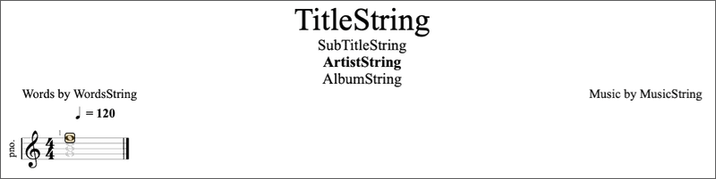
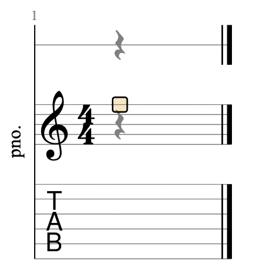

[](https://github.com/music-notation-swift/music-notation)

[](https://github.com/apple/swift-package-manager)
[](https://github.com/music-notation-swift/music-notation/actions/workflows/build-test.yml)
[](https://github.com/music-notation-swift/music-notation/actions/workflows/swiftlint.yml)


# music-notation

Cross-Platform Music Notation API written in Swift. It is written so that it can be used in most any operating system, such as iOS, macOS, tvOS. Windows & Linux is aspirational at this point, but since the plan is to eschew all dependencies, this should not be much of a stretch. This library is being created with the goal of having 0 dependencies; not even Foundation.

`music-notation` is meant to implement the model and controller layers, which understands how music notation works. It will have no render capabilities, nor input/output. Those functionalities will be implemented in add-on packages.

See `music-notation-render` and `music-notation-io` as well as `music-notation-import`.

The goal is to provide these as Swift Package Manager based packages. Cocoapods and Carthage will no longer be supported. Manually adding the package into Xcode projects will still be supported.

Please consult this [Swift style guide](https://github.com/music-notation-swift/swift-style-guide) for coding style guidelines used in this repo and be sure to adhere to them.

There is a Slack channel you can join if you want to see more into the development process at [Music Notation Swift Slack](https://join.slack.com/t/musicnotationswift/shared_invite/enQtOTE1NzQyMzI5MTA2LWZlN2MyNmI5MjA2Njc4MGQ5N2IxNzYzY2QxMmYwNmFlNDNmNjUwNjBlMGY1MWIzNDkxMzY2MzAwNjc4NTJkNjU).

## Contents

- [1. Features](#1-features)
- [2. Requirements](#2-requirements)
- [3. Installation](#3-installation)
	- [3.1 Swift Package Manager](#31-swift-package-manager)
	- [3.2 Manual Installation](#32-manual-installation)
- [4. Getting Started](#4-getting-started)
- [5. Configuration](#5-configuration)
- [6. Examples](#6-examples)
- [7. Definitions](#7-definitions)
	- [7.1 Score](#71-score)
	- [7.2 Parts](#72-parts)
	- [7.3 Staves](#73-staves)
		- [7.4.1 Duration](#741-duration)
		- [7.4.2 Pitch](#742-pitch)
		- [7.4.3 Rests](#743-rests)
- [8. FAQ](#8-faq)
- [9. Notes](#9-development-notes)
- [10. Contributing](#10-contributing)
- [11. License](#11-license)
- [12. Attributions](#12-attributions)

## 1. Features

- [x] Modern Swift API
- [x] High Performance Music Notation modeling
- [x] No 3rd party dependencies
- [x] Comprehensive Unit and Performance Test Coverage
- [x] Complete Documentation
- [x] Modular Design for Package Based Extension

## 2. Requirements

- macOS 10.15+ / iOS 13+ / tvOS 13+ / watchOS 7+
- Swift 5.3+

> Note please see [Package.swift](Package.swift) for the latest Requirements

## 3. Installation

`music-notation` can be installed using [Swift Package Manager](https://swift.org/package-manager/), or manually.

### 3.1 Swift Package Manager

Swift Package Manager requires Swift version 4.0 or higher. First, create a `Package.swift` file. It should look like:

```swift
dependencies: [
    .package(url: "https://github.com/music-notation-swift/music-notation.git", from: "0.2.9")
]
```

`swift build` should then pull in and compile `music-notation` for you to begin using.

#### 3.1.1 Xcode SPM Support

You can also install SPM packages directly within your Xcode project.

### 3.2 Manual Installation

To install manually, you'll need to clone the `music-notation` repository. You can do this in a separate directory or you can
make use of git submodules. Once this is done, you can just drop the files that are in the `Sources/music-notation` folder
into your project. If you use a folder reference instead of a group, every time you pull from the source repository you will get
any newly added files without having to determine if new files were added and then manually adding them.

> NOTE: if you're targeting iOS 7, you'll have to install manually because
> embedded frameworks require a minimum deployment target of iOS 8 or OSX
> Mavericks.

## 4. Getting Started

**WIP** [music-notation-import](https://github.com/music-notation-swift/music-notation-import) is currently the first real client and usage example for the package.
It isn't on github yet, but as soon as it starts working, I will be selecting snippets to show here.

## 5. Configuration

**WIP** Since much of the concrete implementation will be in packages, this will be the main avenue for configuration.

## 6. Examples

**WIP**

## 7. Definitions

For the purpose of describing music and the parts that are modelled by this library, some definitions will be required.
This will inform the name of the classes and structs that model these components.

### 7.1 Score

A score is description in music notation of a piece of music which contains one or more parts. It also contains descriptions which pertain to the score overall.

Examples include:
- Name of the score
- Name of the Artist
- Subtitle of the piece of music that the score describes.

Here is an example of (part of) a score (Beethoven - Symphony No. 9 Op. 125, downloaded from Musescore.com).


In the example you can see elements of the score as well as the staves that make up each of the individual parts.

### 7.2 Parts

A part models a single instrument in the score and as such describes the attributes of the Instrument, as well as part specific data, including one or more staves.

Examples include:
- Transposition data
- Which staves are present

Here are some examples of a part. In this case they are all a Piano part of a score made for illustration purposes.

- A part with a single staff (**note**: this shows the title, subtitle, and more)
	
- A part with a grand staff (treble and bass clef staves)
	
- A part with a single staff, as well as a slash notation staff and a Tablature staff
	

### 7.3 Staves

Music notation at its essense is represented by one or more staves. One staff consists of five horizontal lines, called _staff lines_:


### 7.4 Notes

Each staff usually contains a single _melody_, which often is played by a single instrument. A melody consists of a sequence of _tones_, which are to be played. Each tone is a sound, which a _pitch_ and a _duration_, and the musician that plats the melody, is supposed to emit the sounds corresponding to these tones.

#### 7.4.1 Duration

A note consist of a note head, an optional stem connected to the note head, and an optional flag or beam connected to the stem. The attributes of these decide the duration of a tone:

The duration of one whole note equals the duration of sixteen 16th notes, and so on. The speed, or tempo, of the music, is constant throughout a score. This means that each whole note in a score takes equally long time to play; this is usually between 1 and 4 seconds.

#### 7.4.2 Pitch

The vertical position of a note head defines the tone’s frequency, or pitch. Each pitch is named with an alphabetic letter between a and g, followed by a number of ′ symbols; each ′ symbol denotes that the frequency is multiplied by two. Each staff line represents a pitch. Usually, the pitch on the middle line is b′; this is indicated by drawing a clef in the left edge of the staff. With other clefs, staff lines represent other pitches.


Notes that are typeset in the upper half of a staff, are often typeset upside down. This is a purely typographical decision, and does not affect the semantics of music.

#### 7.4.3 Rests

Silence can be notated using rests. A rest works like a note, except that the musician is silent for the duration of the rest. Rests are notated with special symbols:


The vertical position of a rest has no significance, and unlike notes, rests can not be typeset upside down.

### Measures

Notes are played in sequence, from left to right. Time is split into measures of equal duration, separated by bar lines. The duration of each measure is defined by the time signature, which denotes a fraction of a whole note and the meter at which these are accentuated. Until a new time signature is annotated, all the following measures are of the same time signature.


## 8. FAQ

## 9. Development Notes

`music-notation` and the libraries that flesh out specific components based on it, are based on earlier work that can be found in:
- [MusicNotationCore](https://github.com/drumnkyle/music-notation-core)
- [MusicNotationKit](https://github.com/drumnkyle/music-notation-kit)

`music-notation` and the add-on packages are first and foremost designed as Swift Package Manager packages and as such will not provide Xcode projects.
A notable exception is [music-notation-import](https://github.com/music-notation-swift/music-notation-import) which is a macOS command line utility to parse various other formats and convert them into `music-notation` data structures.

## 10. Contributing

See [CONTRIBUTING](CONTRIBUTING.md) for guidelines to contribute back to
music-notation. This might be a bit premature, but once things start working, please feel free to ask.

## 11. License

`music-notation` is released under the MIT license. See [LICENSE](LICENSE) for details.

## 12. Attributions

**WIP** This is where pointers to documentation attributions go.

Some of the descriptions of basic music theory comes from and/or is adapted from:
• **Separating input language and formatter in GNU Lilypond**, Erik Sandberg <ersa9195@student.uu.se> Master’s Thesis / Examensarbete NV3, 20 credits

